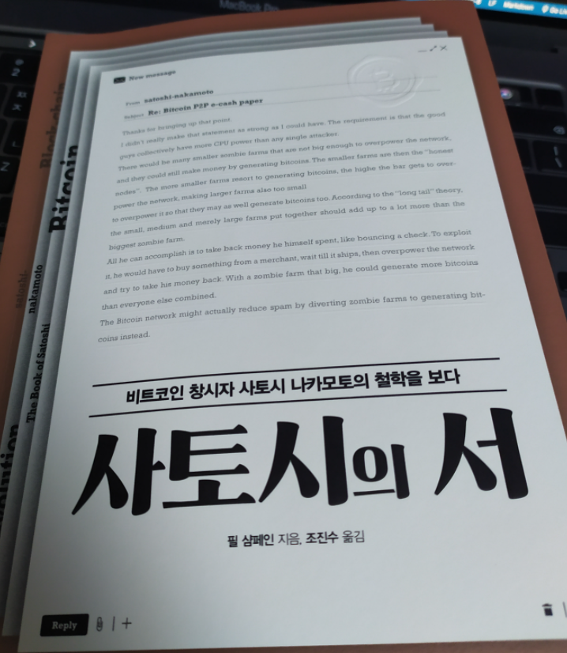

> 비트코인 창시자인 사토시 나카모토가 비트코인 출시 후 기반을 다지던 2년여 동안 주고받은 이메일과 포럼에 남긴 게시물을 담았다. 
> 
> 비트코인과 제작자의 사고방식이 궁금하다면 매우 흥미로울 것이다. 
> 
> 컴퓨터 소프트웨어 배경지식이 있는 사람이 쉽게 읽을 수 있도록 구성되었고, 글 일부는 경제학적 개념을 담고 있어 정보 기술에 대한 배경지식이 없는 경제학자나 투자자도 관심 있게 볼 수 있다.

- [책 소개](https://www.hanbit.co.kr/store/books/look.php?p_code=B5929683476)

 

이해하기 힘든 부분도 있었지만, 전반적으로 쉬운 내용이였다. 

초반부는, 사토시 나카모토가 `비트코인`을 소개하고 

다른 사람들이 흥미를 보이며 여러 문제점을 제기한다. (물런 이미 비트코인 설계에 반영된 부분)

비트코인에 대한 이해를 높이기보단, 책 소개 처럼 사토시 나카모토에 대한 이야기에 흥미가 있다면 읽어볼만 하다.

(모두 10년이 넘은 내용이기때문에 새로운 내용은 나오지 않는다.)

한마디로, 비트코인과 사토시에 관한 재밌는 옛날 이야기